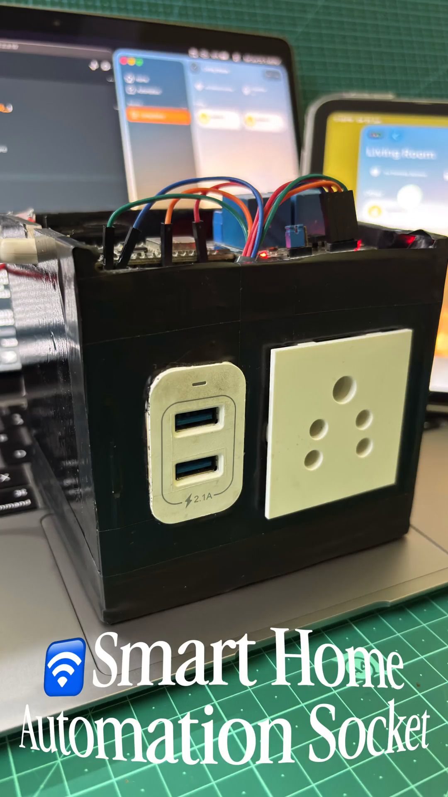

<div align="center">

# HomeKitSocket 🏠

**Control any AC socket or USB hub wirelessly using ESP8266, Apple HomeKit, and Siri — no cloud required.**

[](https://www.espressif.com/)
[](https://www.apple.com/home-app/)
[]()
[](https://www.arduino.cc/)
[](LICENSE)

<br/>



</div>

---

## 📖 Overview

HomeKitSocket turns an ESP8266 NodeMCU and a 2-channel relay module into a fully native Apple HomeKit accessory. The device joins your local Wi-Fi, registers itself as a HomeKit switch pair, and from that point forward responds to the Apple Home app and Siri voice commands — with no cloud service, no third-party hub, and no monthly subscription.

Two independent relay channels give you separate control over a USB charging hub and an AC socket, letting you power cycle any device from your iPhone, Apple Watch, Mac, or by simply saying "Hey Siri."

---

## ✨ Features

- Native Apple HomeKit integration via `arduino-homekit-esp8266`
- Siri voice control: "Hey Siri, turn on Switch 1"
- Two independently controlled outputs: USB hub + AC socket
- Active-LOW relay logic with safe OFF-at-boot default
- Real-time status sync across all Apple devices on the same HomeKit home
- Fully local network operation: no cloud, no latency, no data leaving your home
- Heap and client diagnostics logged to Serial every 5 seconds
- Cross-device Apple ecosystem compatibility: iPhone · iPad · Mac · Apple Watch · HomePod

---

## 🔩 Hardware

| Component | Purpose |
|---|---|
| ESP8266 NodeMCU (v2 / v3) | Main controller · Wi-Fi · HomeKit server |
| 2-Channel Relay Module (5V) | Switches Relay 1 (USB hub) and Relay 2 (AC socket) |
| USB Charging Hub (5V output) | Connected to Relay Channel 1 · charges smartwatches etc. |
| AC Power Socket | Connected to Relay Channel 2 · controls AC-powered devices |
| Breadboard | Circuit prototyping |
| Jumper Wires | Signal and power connections |
| 5V USB Power Supply | Powers NodeMCU and relay module |

---

## 💻 Software

| Dependency | Purpose |
|---|---|
| Arduino IDE 1.8+ / 2.x | Sketch compilation and upload |
| ESP8266 Board Package | NodeMCU board support |
| arduino-homekit-esp8266 | Native HomeKit server on ESP8266 |
| Apple Home App | Accessory pairing and control |
| Siri | Voice command interface |

**Install the ESP8266 board package** — add this URL in Arduino IDE Preferences → Additional Boards Manager URLs:

```
https://arduino.esp8266.com/stable/package_esp8266com_index.json
```

**Install the HomeKit library** via Arduino Library Manager:

```
arduino-homekit-esp8266 by Mixiaoxiao
```

---

## 📁 Project Structure

```
SmartHomeAutomationSocket/
|
+-- Esp8266HomeKitAutomation.ino   # Main sketch: Wi-Fi init, relay GPIO, HomeKit loop
+-- my_accessory.c                 # HomeKit accessory definition: services, characteristics, pairing password
+-- wifi_info.h                    # Wi-Fi credentials and connection helper (⚠ keep private)
+-- Pic1.jpg                       # Hardware photo 1
+-- Pic2.jpg                       # Hardware photo 2
+-- Pic3.PNG                       # Hardware photo 3
+-- README.md
+-- LICENSE
+-- .gitignore
```

> **⚠ Security Note:** `wifi_info.h` contains your Wi-Fi SSID and password. It is listed in `.gitignore` — never commit it with real credentials.

---

## 🔌 Main Sketch

**File:** `Esp8266HomeKitAutomation.ino`

Initialises serial, connects to Wi-Fi, then starts the HomeKit server. Two setter callbacks (`relay1_setter`, `relay2_setter`) fire whenever HomeKit toggles a switch. Each callback writes the correct active-LOW signal to its relay GPIO. A 5-second timer logs free heap and connected HomeKit client count for diagnostics.

```cpp
#include <Arduino.h>
#include <arduino_homekit_server.h>
#include "wifi_info.h"

#define LOG_D(fmt, ...) printf_P(PSTR(fmt "\n"), ##__VA_ARGS__)

#define RELAY1_PIN D2
#define RELAY2_PIN D5

extern "C" homekit_server_config_t config;
extern "C" homekit_characteristic_t cha_relay1_on;
extern "C" homekit_characteristic_t cha_relay2_on;

static uint32_t next_heap_millis = 0;

void relay1_setter(const homekit_value_t value) {
  bool on = value.bool_value;
  cha_relay1_on.value.bool_value = on;
  Serial.printf("Relay 1: %s\n", on ? "ON" : "OFF");
  digitalWrite(RELAY1_PIN, on ? LOW : HIGH);   // Active LOW
}

void relay2_setter(const homekit_value_t value) {
  bool on = value.bool_value;
  cha_relay2_on.value.bool_value = on;
  Serial.printf("Relay 2: %s\n", on ? "ON" : "OFF");
  digitalWrite(RELAY2_PIN, on ? LOW : HIGH);   // Active LOW
}

void my_homekit_setup() {
  pinMode(RELAY1_PIN, OUTPUT);
  pinMode(RELAY2_PIN, OUTPUT);
  digitalWrite(RELAY1_PIN, HIGH);   // OFF at boot
  digitalWrite(RELAY2_PIN, HIGH);
  cha_relay1_on.setter = relay1_setter;
  cha_relay2_on.setter = relay2_setter;
  arduino_homekit_setup(&config);
}

void my_homekit_loop() {
  arduino_homekit_loop();
  const uint32_t t = millis();
  if (t > next_heap_millis) {
    next_heap_millis = t + 5000;
    LOG_D("Free heap: %d, HomeKit clients: %d",
          ESP.getFreeHeap(),
          arduino_homekit_connected_clients_count());
  }
}

void setup() {
  Serial.begin(115200);
  wifi_connect();
  my_homekit_setup();
}

void loop() {
  my_homekit_loop();
  delay(10);
}
```

---

## 🏷️ Accessory Definition

**File:** `my_accessory.c`

Declares the HomeKit accessory structure: one accessory with three services (Accessory Information + two Switch services). Each switch service exposes an `ON` characteristic bound to a relay. The pairing password is defined here.

```c
#include <homekit/homekit.h>
#include <homekit/characteristics.h>

homekit_characteristic_t cha_relay1_on = HOMEKIT_CHARACTERISTIC_(ON, false);
homekit_characteristic_t cha_relay2_on = HOMEKIT_CHARACTERISTIC_(ON, false);

homekit_characteristic_t cha_relay1_name = HOMEKIT_CHARACTERISTIC_(NAME, "Relay 1");
homekit_characteristic_t cha_relay2_name = HOMEKIT_CHARACTERISTIC_(NAME, "Relay 2");

homekit_accessory_t *accessories[] = {
    HOMEKIT_ACCESSORY(
        .id = 1,
        .category = homekit_accessory_category_switch,
        .services = (homekit_service_t *[]) {
            HOMEKIT_SERVICE(ACCESSORY_INFORMATION, .characteristics = (homekit_characteristic_t *[]) {
                HOMEKIT_CHARACTERISTIC(NAME, "ESP8266 Relay Controller"),
                HOMEKIT_CHARACTERISTIC(MANUFACTURER, "Fayas"),
                HOMEKIT_CHARACTERISTIC(MODEL, "NodeMCU ESP8266"),
                HOMEKIT_CHARACTERISTIC(FIRMWARE_REVISION, "1.0"),
                HOMEKIT_CHARACTERISTIC(IDENTIFY, my_accessory_identify),
                NULL }),
            HOMEKIT_SERVICE(SWITCH, .primary = true, .characteristics = (homekit_characteristic_t *[]) {
                &cha_relay1_on, &cha_relay1_name, NULL }),
            HOMEKIT_SERVICE(SWITCH, .characteristics = (homekit_characteristic_t *[]) {
                &cha_relay2_on, &cha_relay2_name, NULL }),
            NULL }),
    NULL };

homekit_server_config_t config = {
    .accessories = accessories,
    .password    = "111-11-111"
};
```

---

## 📶 Wi-Fi Configuration

**File:** `wifi_info.h` — **Do not commit with real credentials.**

```cpp
// wifi_info.h — replace with your own credentials before uploading
const char *ssid     = "YOUR_WIFI_SSID";
const char *password = "YOUR_WIFI_PASSWORD";

void wifi_connect() {
    WiFi.persistent(false);
    WiFi.mode(WIFI_STA);
    WiFi.setAutoReconnect(true);
    WiFi.begin(ssid, password);
    while (!WiFi.isConnected()) { delay(100); Serial.print("."); }
    Serial.printf("\nWiFi connected, IP: %s\n", WiFi.localIP().toString().c_str());
}
```

---

## 🔗 Circuit Connections

| Signal | NodeMCU Pin | Relay Module Pin | Notes |
|---|---|---|---|
| Relay 1 Control | D2 (GPIO4) | IN1 | Active LOW · USB Hub |
| Relay 2 Control | D5 (GPIO14) | IN2 | Active LOW · AC Socket |
| VCC | 3.3V / 5V | VCC | Check relay module voltage requirement |
| GND | GND | GND | Common ground |
| USB Hub | — | NO1 + COM1 | Normally Open side of Relay 1 |
| AC Socket | — | NO2 + COM2 | Normally Open side of Relay 2 |

> **Tip:** Both relays default to HIGH (OFF) at boot to prevent unexpected device activation on power-up or reset.

> **⚠ AC Safety Warning:** Working with mains AC voltage is dangerous. Ensure all AC wiring is properly insulated and handled by a qualified individual. Never touch live AC terminals.

---

## ⚙️ Installation

**1. Clone the repository**

```bash
git clone https://github.com/MohammadFayasKhan/HomeKitSocket.git
cd HomeKitSocket
```

**2. Add ESP8266 board support**

In Arduino IDE → Preferences → Additional Boards Manager URLs, add:

```
https://arduino.esp8266.com/stable/package_esp8266com_index.json
```

Then: Tools → Board → Boards Manager → search `esp8266` → Install

**3. Install the HomeKit library**

```
Tools → Manage Libraries → search "arduino-homekit-esp8266" → Install
```

**4. Set your Wi-Fi credentials**

Edit `wifi_info.h`:

```cpp
const char *ssid     = "YOUR_WIFI_SSID";
const char *password = "YOUR_WIFI_PASSWORD";
```

**5. Select board and port**

```
Tools → Board      → NodeMCU 1.0 (ESP-12E Module)
Tools → Port       → /dev/cu.usbserial-XXXX  (macOS) | COM# (Windows)
```

**6. Upload the sketch**

```
Sketch → Upload   (Ctrl + U / Cmd + U)
```

**7. Open Serial Monitor to verify**

```
Tools → Serial Monitor → 115200 baud
```

You should see Wi-Fi connected and the local IP address printed.

---

## 🚀 Usage

**Pairing with Apple Home**

1. Open the **Home** app on iPhone or iPad.
2. Tap **+** → **Add Accessory** → **More options**.
3. Select **ESP8266 Relay Controller** from the list.
4. Enter pairing code: **`111-11-111`**
5. Two switches appear: **Relay 1** (USB Hub) and **Relay 2** (AC Socket).

**Apple Home control**

- Tap a switch → relay activates instantly.
- Toggle from any Apple device on the same HomeKit home.

**Siri voice commands**

```
"Hey Siri, turn on Switch 1"    → USB hub powers on  → smartwatch starts charging
"Hey Siri, turn off Switch 1"   → USB hub powers off → charging stops
"Hey Siri, turn on Switch 2"    → AC socket powers on  → iPad charger active
"Hey Siri, turn off Switch 2"   → AC socket powers off → charging stops
```

---

## 🧠 How It Works

**HomeKit on Bare Metal**
The `arduino-homekit-esp8266` library runs a full HAP (HomeKit Accessory Protocol) server directly on the ESP8266's TCP stack. No bridge device, no cloud relay, no Raspberry Pi needed. The accessory structure defined in `my_accessory.c` is compiled into the firmware and advertised over mDNS as soon as the device connects to Wi-Fi.

**Active-LOW Relay Logic**
Most 5V relay modules use active-LOW inputs: driving the control pin LOW energises the coil and closes the circuit, while HIGH keeps it open. Both relays are driven HIGH at boot, ensuring all connected devices remain off until explicitly commanded by HomeKit.

**Switch-to-Relay Mapping**
Each HomeKit `SWITCH` service exposes one `ON` boolean characteristic. When toggled, the library calls the registered setter function (`relay1_setter` or `relay2_setter`), which writes the corresponding GPIO pin. The state is also written back to the characteristic so all paired Apple devices reflect the true relay state in real time.

**Diagnostics**
Every 5 seconds the sketch logs `ESP.getFreeHeap()` and `arduino_homekit_connected_clients_count()` over Serial. This makes it easy to spot memory leaks or unexpected client disconnections without attaching a debugger.

---

## 🔀 Switch Mapping

| Switch | Relay | Connected Device | ON Action | OFF Action |
|---|---|---|---|---|
| Switch 1 | Relay 1 · D2 | USB Charging Hub | Hub powers on · charging begins | Hub powers off · charging stops |
| Switch 2 | Relay 2 · D5 | AC Power Socket | Socket live · device charges | Socket off · device stops |

---

## 🖼️ Screenshots

<div align="center">
<table>
  <tr>
    <td align="center" width="50%">
      
      <p align="center"><b>Apple Home Control</b><br/><sup>Two switches appearing natively in the Home app</sup></p>
    </td>
    <td align="center" width="50%">
      
      <p align="center"><b>Full Setup Overview</b><br/><sup>USB hub and AC socket independently controlled via Siri</sup></p>
    </td>
  </tr>
</table>
</div>

---

## 🤝 Contributing

1. Fork the repository
2. Create a feature branch: `git checkout -b feature/your-feature`
3. Commit your changes: `git commit -m 'feat: description'`
4. Push and open a Pull Request

---

## 📄 License

MIT License. See [LICENSE](LICENSE) for details.

---

## 👤 Author

**Mohammad Fayas Khan**

GitHub → [MohammadFayasKhan](https://github.com/MohammadFayasKhan)

*Built for learning, experimentation, and embedded systems exploration.*
